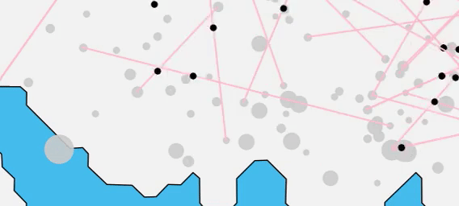

# bikework
collection of oslo bysykkel munging utilities and visualization tools

Currently, this generates visualizations with 60-second resolution, interpolating rider movements
between Oslo Bysykkel docking stations.

 
# Setup
1. Download a historic archive from Oslo Bysykkel's [data warehouse](https://developer.oslobysykkel.no/data) (a small excerpt from May 2018 is located in this repo)
2. Run `python controller.py [historic_data.csv]`
3. Use frames outputted into /img as needed

`run.sh` currently calls imagemagick to autoconvert these to anigifs or mp4s
 
# TODO
- [x] scrape coords out of station status feed
- [x] trip objects succesfully created from trip data
- [x] 1080 minute-collections per day generated
- [x] automate merging of usage data + latlongs
- [x] render trip vectors
- [x] animation workflow
- [ ] collect one day of station data to try and mash together
- [ ] evaluate translation to mplleaflet to speed up processing
- [ ] look into deal.gl
